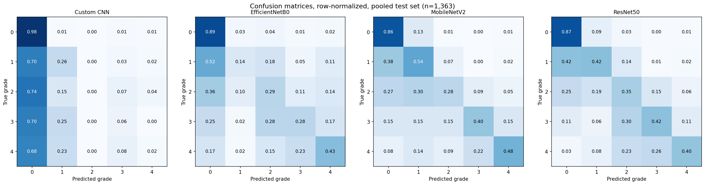
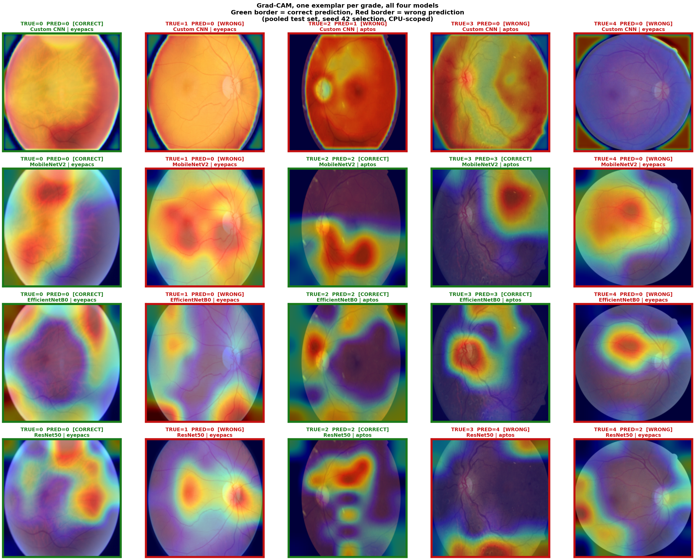

# Diabetic Retinopathy: Implicit Domain Adaptation Across Fundus Photography Sources

LINK TO KAGGLE NOTEBOOK: https://www.kaggle.com/code/asivakumarnair/diabetic-retinopathy-imagenet

## Hypothesis

Pretrained CNNs (EfficientNetB0, MobileNetV2, ResNet50) trained on data pooled across multiple heterogeneous fundus photography sources actively exploit that cross source variation, features learned on one source transfer and generalize to others. A custom CNN trained from scratch on the same pooled data shows no equivalent gain, because it lacks the pretrained feature basis needed to exploit heterogeneity. This mirrors the skin and chest tasks in the same project, testing whether the effect is a property of pretraining itself rather than a coincidence of any one dataset.

---

## Dataset sources and counts, verified live

Three public fundus photography datasets, every path verified live against the actual Kaggle filesystem before use, not assumed from documentation.

**APTOS 2019**
- `/kaggle/input/competitions/aptos2019-blindness-detection/train.csv`
- `/kaggle/input/competitions/aptos2019-blindness-detection/train_images`
- 3,662 rows, columns `id_code`, `diagnosis`
- Grade distribution: 0: 1805, 1: 370, 2: 999, 3: 193, 4: 295
- Path check: 200/200 sampled images present

**EyePACS (2015 subset only, not 2019)**
- `/kaggle/input/datasets/benjaminwarner/resized-2015-2019-blindness-detection-images/labels/trainLabels15.csv`
- `/kaggle/input/datasets/benjaminwarner/resized-2015-2019-blindness-detection-images/resized train 15`
- 35,126 rows, columns `image`, `level`
- Grade distribution (full set): 0: 25810, 1: 2443, 2: 5292, 3: 873, 4: 708
- Patient ID recoverable from filename via `{id}_{left|right}` regex, 0 extraction failures, 17,563 unique patients across 35,126 images
- Path check: 200/200 sampled images present
- This dataset hosts both a 2015 and 2019 resized folder in the same download. The 2019 folder (`resized train 19`) is the APTOS competition set under a different name, 3,662 files. Pointing EyePACS loading at that folder instead of `resized train 15` would silently reintroduce the exact APTOS/EyePACS overlap the disjointness gate exists to catch.

**Messidor-2**
- `/kaggle/input/datasets/mariaherrerot/messidor2preprocess/messidor_data.csv`
- `/kaggle/input/datasets/mariaherrerot/messidor2preprocess/messidor-2/messidor-2/preprocess`
- 1,744 rows, columns `id_code`, `diagnosis`, `adjudicated_dme`, `adjudicated_gradable`
- Grade distribution: 0: 1017, 1: 270, 2: 347, 3: 75, 4: 35
- `adjudicated_gradable` is 1 for all 1,744 rows, no filtering needed on gradability
- Path check: 200/200 sampled images present
- Images are already preprocessed, 512x512, single resolution, unlike APTOS (15 distinct resolutions, median 1536x2048) or EyePACS (81 distinct resolutions, median 873x1024)

### Source disjointness, verified not assumed

APTOS 3,662 ids, EyePACS 35,126 ids, Messidor 1,744 ids. APTOS ∩ EyePACS: 0, APTOS ∩ Messidor: 0, EyePACS ∩ Messidor: 0. Result: PASS, asserted in code, not just printed.

### Messidor filename structure, decoded not assumed

1,057 rows use a date-style convention with no reliable pairing signal, treated as image-level. 687 rows use an older `IMxxxxxx.JPG` convention, pairing by `index // 2` after sorting, giving 343 full pairs plus 1 singleton (344 groups total, since 687 is odd).

**Pairing agreement (grade match between paired eyes): 74.9%**, verified twice, reproduced identically both times. Random-pairing baseline: 65.4%. An earlier draft's 82.5% figure used a different construction (gap-based consecutive differencing on 332 candidate pairs) than the actual pipeline rule, and was corrected. Both numbers are disclosed rather than reporting only the more favorable one.

### Colour and resolution profile across sources

Computed across 200 sampled images per source:

| Source | Mean RGB | Between-image SD | Within-image SD | Unique sizes | Median H x W | Median aspect (W/H) |
|---|---|---|---|---|---|---|
| APTOS | [107.9, 57.4, 19.6] | [30.8, 15.1, 14.5] | [61.8, 34.0, 13.4] | 15 | 1536 x 2048 | 1.322 |
| EyePACS | [106.6, 74.4, 51.3] | [36.4, 28.9, 28.7] | [55.9, 39.4, 27.8] | 81 | 873 x 1024 | 1.173 |
| Messidor | [119.2, 55.2, 19.4] | [26.9, 15.6, 8.4] | [73.0, 35.0, 13.7] | 1 | 512 x 512 | 1.000 |

This is direct evidence the three sources are genuinely heterogeneous in acquisition characteristics, not just label distribution, publishable evidence for the heterogeneity claim independent of any downstream model result.

### EyePACS subsampling, patient-level, distribution-preserving

Subsampled to APTOS's size (3,662 images, 1,831 unique patients) at the patient level, stratified by max grade, seed 42. All per-class drift under 3 percentage points. Pooled dataset after subsampling: **9,068 images**.

Pooled grade x source crosstab:

| Grade | APTOS | EyePACS (subsampled) | Messidor | Pooled |
|---|---|---|---|---|
| 0 | 1805 | 2694 | 1017 | 5,516 |
| 1 | 370 | 240 | 270 | 880 |
| 2 | 999 | 559 | 347 | 1,905 |
| 3 | 193 | 90 | 75 | 358 |
| 4 | 295 | 79 | 35 | 409 |

### Splitting, per-source rules, patient-leakage checked not assumed

APTOS: image-level (no patient identifier available), 70/15/15 stratified split. EyePACS: patient-level, leakage-checked, PASS. Messidor: mixed, IM-style pairs split at pair-level (leakage PASS, 687 images, 344 groups), date-style rows split at image-level, disclosed as unpaired.

One stratification failure occurred and was handled, not hidden: at the Messidor IM-style val/test split, one grade dropped to a single pair-group, making stratification mathematically impossible. The exact sklearn error: *"The least populated class in y has only 1 member, which is too few. The minimum number of groups for any class cannot be less than 2."* The pipeline's `safe_split` wrapper caught this and fell back to unstratified splitting for that one step, disclosed rather than glossed over.

**Final pooled split: Train 6,344 / Val 1,361 / Test 1,363.**

### Class weights, pooled and per-source

Pooled span: **15.6x**, just under the 16x threshold observed to cause instability elsewhere in this project.

| Source | Weight span (single-source) |
|---|---|
| APTOS | 9.4x |
| EyePACS | 33.7x |
| Messidor | 31.0x |

---

## Environment and configuration, locked

- TensorFlow 2.19.0, installed explicitly (`pip install tensorflow==2.19.0`) before any import
- `TF_USE_LEGACY_KERAS=1` set before import, confirms `tf.keras` resolves to `tf_keras.api._v2.keras`
- Seed 42 throughout, plus `TF_DETERMINISTIC_OPS=1`
- Kaggle notebook, T4 x2 accelerator selected, training run single-GPU, no distribution strategy
- Kaggle account: `asivakumarnair`
- Image size 224x224, batch size 32
- Augmentation (train only): rotation 20, width/height shift 0.1, horizontal flip, zoom 0.1. Vertical flip deliberately off.
- Phase 1 (frozen base): 10 epochs, LR 1e-3. Phase 2 (fine-tune): up to 60 epochs, LR 1e-5, early stopping patience 7. Custom CNN: single phase, LR 1e-3, same patience.
- Default checkpoint monitor: `val_accuracy` for Stages 4-14, with `val_auc` used as the monitor for Stage 16's cross-validation folds specifically (a deliberate, disclosed departure, see Stage 16 below)
- Weight naming: `dr_best_{arch}.keras` for pooled models, `ss_{arch}_{source}_dr.keras` for Stage 11 single-source models

**Custom CNN architecture:** 3 convolutional blocks (32/64/128 filters, each with two conv layers, BatchNorm, MaxPool, Dropout 0.25), GlobalAveragePooling2D, 256-unit dense head, Dropout 0.5, softmax output. **Confirmed 23,109 parameters** for the 5-class DR head.

---

## Stage-by-stage status

| Stage | Status |
|---|---|
| 0-3 | Bootstrap, data build, splits, model definitions | Done |
| 4-7 | Pooled training, all 4 architectures | Done |
| 8 | Post-hoc evaluation, locked metrics | Done |
| 9 | Statistical testing, McNemar + DeLong | Done |
| 10 | Confusion matrices, Grad-CAM, border-attention check | Done |
| 11 | Single-source baseline, 12 models | Done |
| 12 | Cross-source evaluation matrix | Done |
| 13 | MMD, feature-space domain distance | Done |
| 14 | Fine-tune depth ablation | Done |
| 15 | CORAL baseline | Not started, scope decision pending |
| 16 | Five-fold cross-validation | In progress, fold 3 of 5 |
| 17 | Final writeup | Pending |

---

## Stage 4-7: Pooled training, all four architectures

Code: `dr_stage00_bootstrap+stage01__clean_data_build+stage02_split_classweights_generators+stage03_model_definitions+stage04_train_custom_cnn.ipynb`, `dr_stage05_train_efficientnet.ipynb`, `dr_stage07_train_resnet.ipynb` (`dr_stage07.1_train_resnet.ipynb` is the recovered rerun after a session restart lost the first attempt).

| Model | Test Accuracy | Test AUC (training-time) |
|---|---|---|
| Custom CNN | 0.622 | 0.836 |
| EfficientNetB0 | 0.649 | 0.885 |
| MobileNetV2 | 0.671 | 0.904 |
| ResNet50 | 0.679 | 0.909 |

Custom CNN showed real mid-training instability (collapse at epoch 12, recovered by `restore_best_weights`). ResNet50's first Phase 2 attempt was lost to a Kaggle session restart at epoch 9 and rebuilt from scratch with an identical seed.

---

## Stage 8: Post-hoc evaluation, locked reportable numbers

Code: `dr_stage08_lock_results.ipynb`. Data: `dr_stage8_summary.csv`, `dr_stage8_per_class_metrics.csv`, `dr_stage8_confusion_matrices.csv`, `dr_stage8_per_source.csv`, `preds_*.npz`.

**These are the canonical numbers for the paper, not Section "Stage 4-7"'s training-time figures.** All four computed identically (sklearn macro-averaged AUC, QWK), unlike the Keras built-in AUC used during training.

| Model | QWK | Macro-AUC | Accuracy | Macro-F1 |
|---|---|---|---|---|
| Custom CNN | 0.196 | 0.690 | 0.622 | 0.234 |
| EfficientNetB0 | 0.570 | 0.797 | 0.649 | 0.389 |
| MobileNetV2 | 0.686 | 0.855 | 0.671 | 0.490 |
| ResNet50 | 0.704 | 0.864 | 0.679 | 0.476 |

**Key finding:** Custom CNN's pooled checkpoint never predicts grade 2 across the entire test set, and its EyePACS-only QWK (per-source breakdown) is **-0.012, worse than random**.

Per-source breakdown of the pooled models:

| Model | Source | n | QWK | Macro-AUC | Accuracy | Macro-F1 |
|---|---|---|---|---|---|---|
| Custom CNN | aptos | 550 | 0.284 | 0.751 | 0.544 | 0.262 |
| Custom CNN | eyepacs | 550 | -0.012 | 0.539 | 0.720 | 0.168 |
| Custom CNN | messidor | 263 | 0.033 | 0.627 | 0.582 | 0.175 |
| EfficientNetB0 | aptos | 550 | 0.676 | 0.834 | 0.627 | 0.450 |
| EfficientNetB0 | eyepacs | 550 | 0.257 | 0.704 | 0.689 | 0.263 |
| EfficientNetB0 | messidor | 263 | 0.469 | 0.764 | 0.612 | 0.411 |
| MobileNetV2 | aptos | 550 | 0.811 | 0.908 | 0.727 | 0.570 |
| MobileNetV2 | eyepacs | 550 | 0.428 | 0.724 | 0.693 | 0.343 |
| MobileNetV2 | messidor | 263 | 0.598 | 0.820 | 0.506 | 0.477 |
| ResNet50 | aptos | 550 | 0.830 | 0.903 | 0.722 | 0.552 |
| ResNet50 | eyepacs | 550 | 0.403 | 0.768 | 0.704 | 0.329 |
| ResNet50 | messidor | 263 | 0.668 | 0.829 | 0.536 | 0.501 |

---

## Stage 9: Statistical testing

Data: `dr_stage9_mcnemar.csv`, `dr_stage9_delong_plain.csv`, `dr_stage9_delong_correlated.csv`.

### McNemar's test

| Pair | p_holm | Significant |
|---|---|---|
| Custom CNN vs ResNet50 | 0.000040 | Yes |
| Custom CNN vs MobileNetV2 | 0.000790 | Yes |
| Custom CNN vs EfficientNetB0 | 0.096682 | No |
| EfficientNetB0 vs ResNet50 | 0.096682 | No |
| MobileNetV2 vs EfficientNetB0 | 0.247599 | No |
| MobileNetV2 vs ResNet50 | 0.526261 | No |

### DeLong's test, correlated (primary)

| Pair | AUC diff | p_holm | Significant |
|---|---|---|---|
| Custom CNN vs MobileNetV2 | -0.165 | ~0 | Yes |
| Custom CNN vs EfficientNetB0 | -0.107 | ~0 | Yes |
| Custom CNN vs ResNet50 | -0.174 | ~0 | Yes |
| EfficientNetB0 vs ResNet50 | -0.067 | 2.0e-15 | Yes |
| MobileNetV2 vs EfficientNetB0 | +0.058 | 1.7e-10 | Yes |
| MobileNetV2 vs ResNet50 | -0.009 | 0.135 | No |

**Headline:** Custom CNN is significantly worse than all three pretrained models, on every test. Among the pretrained models, ResNet50 beats EfficientNetB0 (both tests agree), ResNet50 vs MobileNetV2 is statistically indistinguishable (both agree), and MobileNetV2 vs EfficientNetB0 is borderline (correlated DeLong significant, McNemar not). Plain DeLong systematically under-detects significant differences relative to the correlated variant, consistent with the same pattern independently observed in this project's skin and chest tasks.

---

## Stage 10: Confusion matrices, Grad-CAM, border-attention check

Code: `dr_stage10_confusion_gradcam.ipynb`. Data: `dr_stage10_border_attention.csv`.

### Confusion matrices, all four models, pooled test set

Row-normalized. Custom CNN's grade 0 row shows 0.98 (near-perfect), every other row shows heavy bias back toward grade 0, confirming Stage 8's finding numerically and visually.

### Grad-CAM, one exemplar per grade, all four models

CPU-scoped (GPU determinism conflict with BatchNorm backprop required this) and nested-graph-aware (the pretrained models' base is nested one layer inside the outer Sequential, requiring a manual two-stage feature extraction rather than a single connected graph). Green border = correct prediction, red border = wrong.

### Border-attention check (pre-registered, testing for shape-shortcut learning)

**13 of 20 exemplar/model combinations flagged** (more than 35% of Grad-CAM attention energy in the outer 15% border ring). 8 of the 13 flagged cases were EyePACS-sourced, plausibly linked to EyePACS having the widest resolution variation of the three sources (81 distinct sizes) and getting resized to a fixed square without letterboxing. Not proof of shape-shortcut learning on its own, flagged as needing visual inspection.

---

## Stage 11: Single-source training, all 12 models

Code: `dr_stage11.1.1` through `dr_stage11.3.2_singlesource_baseline.ipynb` (six notebooks covering all 12 architecture-source combinations).

| Architecture | APTOS Acc/AUC | EyePACS Acc/AUC | Messidor Acc/AUC |
|---|---|---|---|
| Custom CNN | 0.700 / 0.908 | **0.158 / 0.558** | 0.582 / 0.808 |
| EfficientNetB0 | 0.673 / 0.915 | 0.631 / 0.849 | 0.608 / 0.880 |
| MobileNetV2 | 0.633 / 0.914 | 0.558 / 0.839 | 0.608 / 0.874 |
| ResNet50 | 0.773 / 0.942 | 0.551 / 0.839 | 0.498 / 0.845 |

**Key findings:**
- Custom CNN is the only architecture whose accuracy swings dramatically by source (4.4x range), while all three pretrained models stay within a much narrower band regardless of source. The cleanest evidence in this task for implicit domain adaptation, independent of pooling entirely.
- Custom CNN on EyePACS collapsed to near/below chance (0.158 accuracy; chance is 0.20 for 5 classes).
- EyePACS is the hardest source for every architecture.
- No architecture wins on every source. ResNet50 wins APTOS and ties for best on EyePACS, but is the weakest of the three pretrained models on Messidor, plausibly an overfitting effect given ResNet50's larger capacity relative to Messidor's small training set.

---

## Stage 12: Cross-source evaluation matrix

Code: `dr_stage12_crosssource_matrix.ipynb`. Data: `dr_stage12_crosssource.csv`, `dr_stage12_auc_drop_summary.csv`, 36 `s12_preds_*.npz` files.

All 12 Stage 11 checkpoints evaluated against all three sources' test sets (36 cells), gated against Stage 11's locked accuracy figures (all 12 reproduced exactly, `diff 0.000000`).

**Off-diagonal AUC drop per architecture:**

| Architecture | Mean drop | Median drop |
|---|---|---|
| Custom CNN | 0.2133 | 0.1721 |
| ResNet50 | 0.1382 | 0.1376 |
| EfficientNetB0 | 0.1197 | 0.1259 |
| MobileNetV2 | 0.1156 | 0.1268 |

**Key findings:** Custom CNN's cross-source QWK is exactly 0.0000 on 6 of 9 cells (every cell trained on EyePACS or Messidor), consistent with the degenerate, single-grade-collapse behaviour Stage 8 already found. ResNet50, despite being the strongest within-source performer, generalizes *worst* of the three pretrained models across sources, a real tension worth stating plainly: highest within-source accuracy does not guarantee the smallest domain gap.

---

## Stage 13: MMD, feature-space domain distance

Code: `dr_stage13_mmd.ipynb`.

Penultimate-layer (256-d) feature extraction from all 12 single-source models plus the 4 pooled models, computed under three independent gamma (kernel bandwidth) conventions to confirm results don't depend on that choice: a single global value, one value per architecture, and a fixed value decided in advance (1/256).

**All three conventions agreed on every directional finding:**

- **Pooling did not compress feature-space separation between sources** for three of four architectures (Custom CNN, EfficientNetB0, ResNet50 all showed negative reduction, meaning pooled training increased separation relative to single-source training). MobileNetV2 was the one near-neutral exception.
- **Custom CNN's features are not more separated than the pretrained models', they are less separated** (`custom_higher = False` on all 9 pair/convention combinations). This contradicts the simple mechanistic story that Custom CNN fails because it sees the sources as more different internally, plausibly because Custom CNN's cruder representation captures less surface detail from any source, not because it unified them meaningfully.
- **Feature-space MMD correlates with Stage 12's QWK drop** (global gamma: r=0.422, p=0.040; per-architecture gamma: r=0.565, p=0.004; fixed gamma: r=0.392, p=0.058), but does **not** correlate with the AUC drop under any convention. MMD relates to whether a model keeps its ordinal severity-ranking intact across sources, not to whether it gets the exact grade right.

---

## Stage 14: Fine-tune depth ablation

Code: `dr_stage14_finetune_ablation.ipynb`.

ResNet50 (DR's strongest pooled performer), pooled data, three arms: frozen (reload existing head-only checkpoint), partial (new training, unfreeze `conv4_block1` onward, contiguous-index unfreeze to avoid a frozen-BatchNorm-in-gradient-path crash), full (reload existing Stage 7 result).

| Depth | QWK | Macro-AUC | Accuracy | Macro-F1 | Sensitivity | Specificity |
|---|---|---|---|---|---|---|
| Frozen | 0.667 | 0.829 | 0.635 | 0.423 | 0.461 | 0.890 |
| **Partial** | **0.729** | **0.870** | 0.677 | **0.499** | **0.526** | 0.900 |
| Full | 0.705 | 0.864 | **0.679** | 0.476 | 0.492 | 0.900 |

**Key finding:** Partial unfreeze beats full unfreeze on QWK, macro-AUC, macro-F1, and sensitivity, only losing narrowly on raw accuracy. Full unfreeze shows real overfitting (train accuracy reached 0.76 while validation stayed flat around 0.64-0.68). Fine-tuning depth matters independently of whether pretraining helps at all, and more unfreezing is not always better past a point. This finding motivated, but does not retroactively change, the main pipeline's full-unfreeze protocol, kept fixed for consistency with the other locked stages and with the skin and chest tasks.

---

## Stage 15: CORAL baseline

Not started. Scope decision pending (may be deferred, as it was in the skin task).

---

## Stage 16: Five-fold cross-validation, in progress

Code so far: `dr_stage16.cvfold1.customcnn+effnet.ipynb`, `dr_stage16.cvfold1.mobilenetv2+resnet50.ipynb`, `dr_stage16.cvfold2.customcnn+effnetb0.ipynb`, `dr_stage16.cvfold2.mobnetv2+resnet50.ipynb`. Fold 3's notebooks are complete for Custom CNN, EfficientNetB0, and MobileNetV2 (not yet uploaded to this repo); ResNet50 for fold 3 is in progress.

**Method:** stratified group five-fold cross-validation with an inner validation split. Genuine k-fold, not Monte Carlo, group-safe across all three sources' own grouping structure (real patient IDs for EyePACS, pair-derived groups for Messidor IM-style, singleton groups for the 52% of pooled data with no grouping signal at all, APTOS and Messidor date-style). Fold-major execution: all four architectures complete within a fold before the next fold starts.

**Checkpoint monitor, a deliberate departure from the rest of the pipeline:** every fold-architecture run saves two checkpoints from the same training pass, one selected on `val_auc` (primary, matches the project's stated primary metric) and one on `val_accuracy` (secondary comparison). This was chosen specifically because Stage 16's smaller per-fold training sets are exactly the condition (severe class imbalance under reduced data) that already caused real instability elsewhere in this project, and unlike earlier stages, there is no manual per-run oversight across 20 unattended fold-architecture runs to catch a collapse and react to it. Both checkpoints are reloaded, provenance-verified (against a live in-memory check for the AUC checkpoint, and against the training-time validation history for the accuracy checkpoint), and reported.

**Fold 1 (complete, 4/4):**

| Arch | Selected by | QWK | Macro-AUC | Accuracy |
|---|---|---|---|---|
| Custom CNN | val_auc | 0.400 | 0.673 | 0.621 |
| EfficientNetB0 | val_auc | 0.704 | 0.870 | 0.654 |
| MobileNetV2 | val_auc | 0.620 | 0.840 | 0.640 |
| MobileNetV2 | val_accuracy | 0.607 | 0.837 | 0.646 |
| ResNet50 | val_auc | 0.633 | 0.831 | 0.695 |

(Custom CNN, EfficientNetB0, ResNet50 had identical val_auc/val_accuracy checkpoints in fold 1, the two monitors agreed on the same epoch.)

**Fold 2 (complete, 4/4):**

| Arch | Selected by | QWK | Macro-AUC | Accuracy |
|---|---|---|---|---|
| Custom CNN | val_auc | 0.368 | 0.717 | 0.638 |
| EfficientNetB0 | val_auc | 0.683 | 0.855 | 0.663 |
| EfficientNetB0 | val_accuracy | 0.664 | 0.853 | 0.657 |
| MobileNetV2 | val_auc | 0.589 | 0.826 | 0.612 |
| MobileNetV2 | val_accuracy | 0.572 | 0.833 | 0.634 |
| ResNet50 | val_auc | 0.671 | 0.859 | 0.688 |

**Fold 3 (custom, eff, mob complete, res in progress):**

| Arch | Selected by | QWK | Macro-AUC | Accuracy |
|---|---|---|---|---|
| Custom CNN | val_auc | 0.392 | 0.710 | 0.676 |
| EfficientNetB0 | val_auc | 0.721 | 0.873 | 0.698 |
| MobileNetV2 | val_auc | 0.601 | 0.844 | 0.616 |
| MobileNetV2 | val_accuracy | 0.508 | 0.810 | 0.626 |

**Key finding, checkpoint monitor divergence:** across the 11 architecture-fold runs completed so far, **MobileNetV2 has diverged in all 3 folds it has appeared in (0/3 agreement)**, while Custom CNN (3/3) and ResNet50 (2/2) have agreed in every fold, and EfficientNetB0 agreed in 2 of 3. This looks like a genuine, repeatable, architecture-specific property rather than noise, plausibly linked to MobileNetV2's less smooth validation trajectory under full unfreeze, the same instability already flagged independently in Stage 11. The val_auc-selected checkpoint has won on QWK and macro-AUC in every divergent case so far.

**Remaining:** fold 3 ResNet50, then folds 4 and 5 (all four architectures each), then the final fold-combination step (mean and standard deviation per architecture across all 5 folds, reported for both monitor choices).

---

## Stage 17: Final writeup

Pending, assembled once Stages 15 and 16 are locked.

---

## Repository file index

**Pooled model weights and logs:** `dr_best_*.keras` referenced in code (not committed to this repo, hosted on Kaggle at `asivakumarnair/drbestmodels`), `dr_custom_log.csv`, `dr_efficientnet_log.csv`, `dr_mobilenet_log.csv`, `dr_resnet50_log.csv`, `dr_phase1_*_log.csv`

**Splits:** `dr_train_split.csv`, `dr_val_split.csv`, `dr_test_split.csv` (pooled), `dr_aptos_{train,val,test}.csv`, `dr_eyepacs_{train,val,test}.csv`, `dr_messidor_{train,val,test}.csv`

**Stage 8:** `dr_stage8_summary.csv`, `dr_stage8_per_class_metrics.csv`, `dr_stage8_confusion_matrices.csv`, `dr_stage8_per_source.csv`, `preds_*.npz`

**Stage 9:** `dr_stage9_mcnemar.csv`, `dr_stage9_delong_plain.csv`, `dr_stage9_delong_correlated.csv`

**Stage 10:** `dr_stage10_confusion_matrices.png`, `dr_stage10_gradcam.png`, `dr_stage10_border_attention.csv`

**Stage 11:** 12 single-source checkpoints hosted on Kaggle at `asivakumarnair/drstage11singlesource`, notebooks `dr_stage11.1.1` through `dr_stage11.3.2_singlesource_baseline.ipynb`

**Stage 12:** `dr_stage12_crosssource.csv`, `dr_stage12_auc_drop_summary.csv`, `s12_preds_*.npz` (36 files)

**Stage 16:** fold assignment file hosted on Kaggle at `asivakumarnair/drcvfoldassignments`, per-fold-per-architecture result CSVs and prediction `.npz` files pending upload as folds complete
