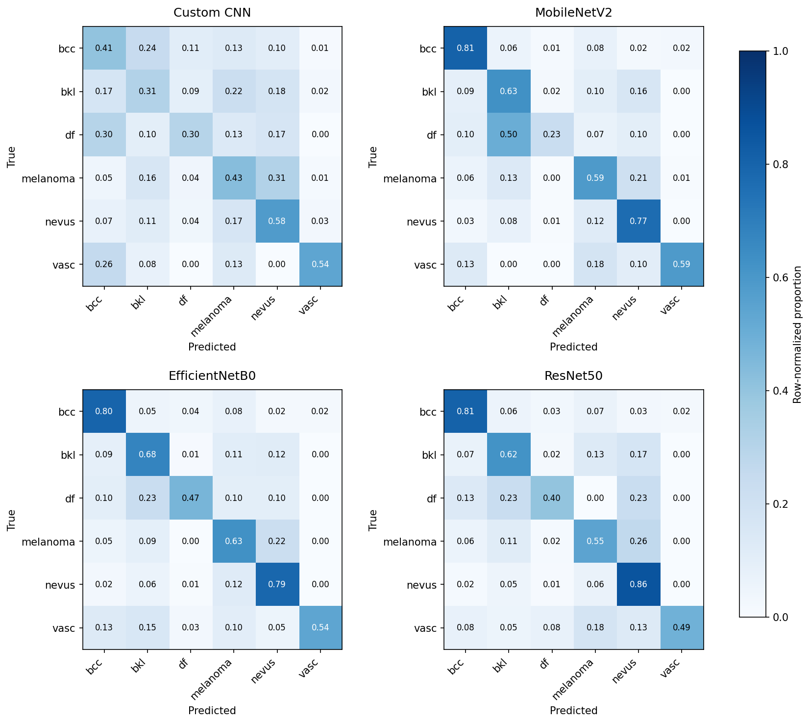
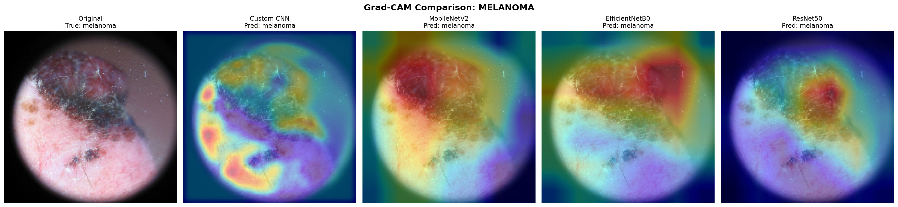

# Lightweight Transfer Learning Across Heterogeneous Medical Imaging Sources

**[Skin](./Skin) · [Chest](./Chest) · [Diabetic Retinopathy](./Diabetic%20Retinopathy)**
Kaggle notebooks: [Skin](https://www.kaggle.com/code/ab0y04/skin-lesion-imagenet) · [Chest](https://www.kaggle.com/code/nihalabhay/chest-imagenet) · [DR](https://www.kaggle.com/code/asivakumarnair/diabetic-retinopathy-imagenet)

## What this tests

ImageNet-pretrained lightweight CNNs (EfficientNetB0, MobileNetV2, ResNet50) are compared against a custom CNN trained entirely from scratch, on pooled data from multiple genuinely disjoint clinical sources. The hypothesis: pretrained models exploit that cross-source heterogeneity, something resembling automatic domain adaptation, purely as a byproduct of pretraining, with no explicit adaptation technique applied. A from-scratch model has no such prior exposure and should not show this to the same degree.

Tested identically across three independent tasks, so that a pattern holding in all three is evidence of something general, not a coincidence of one dataset.

| Task | Sources | Images (pooled) | Output |
|---|---|---|---|
| Skin lesion | ISIC 2019 + HAM10000 | 23,836 | 6-class |
| Chest X-ray pathology | CheXpert + NIH ChestX-ray14 + VinBigData | ~45,000 | Binary |
| Diabetic retinopathy | APTOS 2019 + EyePACS + Messidor-2 | 9,068 | 5-class ordinal |

Every dataset was verified live against the mounted files before use (paths, counts, disjointness), not assumed from documentation. Each task's own README documents the specific contamination risks and bugs this caught, e.g. ISIC 2019 was found to contain HAM10000 as a subset, and EyePACS's own download folder was found to secretly contain the APTOS competition set under a different name.

Shared pipeline: same four architectures, same two-phase fine-tuning, same 17-stage shape (setup → pooled training → statistics/interpretability → single-source baseline → cross-source evaluation → MMD → fine-tune depth ablation → CORAL → 5-fold CV → writeup), same statistical standard (McNemar with Holm correction; correlated DeLong as primary, plain DeLong reported alongside specifically because it understated significance on two architecture pairs in **both** skin and chest). TensorFlow 2.19.0, legacy Keras 2, seed 42, throughout.

## Status at a glance

| Task | Stages 0–14 | Stage 15 (CORAL) | Stage 16 (5-fold CV) | Stage 17 |
|---|---|---|---|---|
| Skin | Done | Open, unresolved (loss-normalization issue found, fix not yet re-run) | **Done**, all 20 runs | Not started |
| Chest | Done | Skipped by decision (protects Stage 16's compute budget) | In progress, fold 1/5 done | Not started |
| Diabetic Retinopathy | Done | Not started | In progress, fold 3/5 (ResNet50 pending) | Not started |

Skin is the furthest along and is currently the only task with a complete 5-fold result. Chest and DR are both mid-cross-validation; between them, roughly 110+ GPU hours of Stage 16 training remains, the largest shared cost left in the project.

## What holds across all three tasks, and what doesn't

**Holds, consistently: the custom CNN generalizes worse to an unseen source than any pretrained model, every task, every time.**
- Skin: in the harder cross-source direction, custom CNN retains only ~33% of its single-source skill vs 58–67% for the pretrained models.
- Chest: custom CNN's mean cross-source AUC drop is 1.8–2.5x larger than any pretrained model's.
- DR: custom CNN's mean cross-source AUC drop is the largest of the four architectures, and its cross-source QWK is exactly 0.0000 on 6 of 9 source pairs.

**Does not hold, and this is disclosed rather than smoothed over: the feature-space mechanism (MMD) behind that effect is not the same story in each task.**
- Skin: custom CNN's internal feature separation between sources is ~2x every pretrained model's, MMD supports the effect as a real mechanism.
- Chest: MMD shows no relationship to the behavioral drop at all (r = −0.07, p = 0.73), a null result.
- DR: custom CNN's features are actually **less** separated than the pretrained models', the opposite direction from skin.

The behavioral finding replicates cleanly. The mechanistic explanation for *why* does not, and is reported that way rather than forced to agree across tasks. This is treated as a real, task-complexity-dependent open question for the paper, not a bug to fix.

## Skin Lesion Classification

Two dermoscopic sources, 6 classes (bcc, bkl, df, melanoma, nevus, vasc). Full rerun after catching a class-contamination bug (AK/SCC images silently mislabeled as melanoma) and a source-overlap bug (ISIC 2019 contained all of HAM10000).

| Model | Accuracy | Macro F1 | Macro AUC |
|---|---|---|---|
| Custom CNN | 0.4973 | 0.3529 | 0.7724 |
| MobileNetV2 | 0.7185 | 0.5741 | 0.9032 |
| EfficientNetB0 | 0.7429 | 0.6201 | **0.9252** |
| ResNet50 | **0.7627** | 0.6043 | 0.9161 |

Accuracy-best and AUC-best are different models here; EfficientNetB0 also has the best melanoma recall, the clinically relevant number. Fine-tune depth ablation (EfficientNetB0) is a clean, monotonic climb: frozen 0.5437 → partial unfreeze 0.6373 → full unfreeze 0.7429. **Stage 16 (5-fold CV) is complete**: the two strongest pretrained models are also the most stable across folds (accuracy spread ~0.03), custom CNN and MobileNetV2 are noticeably less stable (~0.08), a second, independent line of evidence for the hypothesis.

*Only EfficientNetB0 classifies this melanoma correctly, attention on the actual lesion; custom CNN misclassifies it with attention on an unrelated hotspot. Two further exemplars (bcc, df) are in the [Skin README](./Skin).*

Open item: Stage 15 (CORAL) is unresolved, an earlier run trained without error but its loss normalization made the domain-alignment term negligible, so it wasn't actually testing what it claimed to.

## Chest X-Ray Pathology Detection

Three sources with deliberately different, unbalanced pathology prevalence (90.0% / 46.2% / 29.3%), treated as a second real axis of domain gap rather than corrected away. Binary presence-detection, chosen specifically because the three sources' pathology vocabularies don't agree with each other.

| Model | AUC | Accuracy | Macro-F1 | Sensitivity | Specificity |
|---|---|---|---|---|---|
| Custom CNN | 0.8921 | 0.7852 | 0.7783 | 0.8897 | 0.6621 |
| EfficientNetB0 | 0.9190 | 0.8327 | 0.8324 | 0.8113 | 0.8580 |
| MobileNetV2 | 0.9175 | 0.8350 | 0.8343 | 0.8357 | 0.8342 |
| ResNet50 | **0.9280** | **0.8453** | **0.8446** | **0.8448** | **0.8459** |

ResNet50 wins every metric here, unlike skin. CheXpert specificity collapses toward zero for all four models (a real, disclosed finding, not a bug: CheXpert is 90% pathology, so the checkpoint monitor was switched from `val_accuracy` to `val_auc` project-wide after custom CNN's CheXpert-only run first collapsed to exactly 0.0 specificity at 89% accuracy). Fine-tune ablation: unfreezing just the last ~13% of EfficientNetB0's backbone (0.9197 AUC) matches full unfreeze (0.9190), most of the benefit lives in the pretrained features themselves.

*Exemplars chosen systematically: images where custom CNN was wrong and all three pretrained models were correct. 501 of 567 qualifying cases were no-finding images, itself a visual trace of the CheXpert specificity issue above.*

## Diabetic Retinopathy Grading

Three fundus sources, 5-grade ordinal severity. EyePACS subsampled to APTOS's size at the patient level to prevent it dominating the pool.

| Model | QWK | Macro-AUC | Accuracy | Macro-F1 |
|---|---|---|---|---|
| Custom CNN | 0.196 | 0.690 | 0.622 | 0.234 |
| EfficientNetB0 | 0.570 | 0.797 | 0.649 | 0.389 |
| MobileNetV2 | 0.686 | 0.855 | 0.671 | 0.490 |
| ResNet50 | **0.704** | **0.864** | **0.679** | 0.476 |

Custom CNN's pooled checkpoint never once predicts grade 2 in the entire test set, and its EyePACS-only QWK is **−0.012**, worse than random guessing. Worth flagging: ResNet50 wins every pooled metric but generalizes *worst* of the three pretrained models across sources on Stage 12, highest within-source accuracy did not mean the smallest domain gap here. Fine-tune ablation (run on ResNet50, DR's strongest architecture, unlike the other two tasks): partial unfreeze actually **beat** full unfreeze on QWK (0.729 vs 0.705), macro-AUC, F1, and sensitivity, full unfreeze visibly overfit. This finding is noted but does not retroactively change the locked full-unfreeze protocol, kept fixed for consistency with skin and chest.

*Green border = correct, red = wrong. A pre-registered border-attention check flagged 13 of 20 exemplar/model combinations for possible shape-shortcut attention, 8 of the 13 EyePACS-sourced, plausibly linked to that source's wide resolution variation getting resized without letterboxing. Flagged as needing visual inspection, not treated as proven.*

## Reproducing this work

Each task folder is self-contained, exact dataset paths, verified counts, split logic, class weights, environment pins, every bug caught and fixed, and full stage-by-stage status. Start there for implementation detail; this document is only the map across all three.
