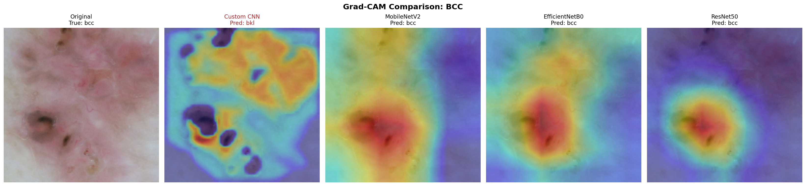
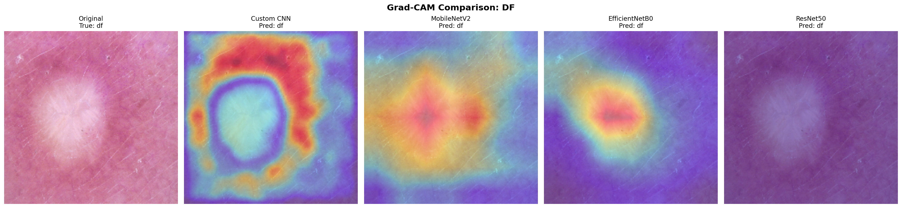

# Skin Lesion Classification: Implicit Domain Adaptation via Lightweight Pretrained CNNs

## Overview

This task benchmarks four CNN architectures, one trained from scratch and three ImageNet pretrained (EfficientNetB0, MobileNetV2, ResNet50), on multi source dermoscopic skin lesion classification across two genuinely disjoint clinical sources: ISIC 2019 and HAM10000. The central hypothesis is that lightweight ImageNet pretrained CNNs pick up something resembling automatic cross institution domain adaptation purely from having been pretrained on a large, diverse natural image corpus, without any explicit domain adaptation technique applied. A model trained entirely from scratch, with no such prior exposure, should not show this property to the same degree.

This is a full rerun of an earlier version of this task. The original results (Custom CNN 52.84 percent, MobileNetV2 76.63 percent, EfficientNetB0 82.98 percent, ResNet50 88.35 percent accuracy) are superseded and invalid. They are documented here only so their numbers are never mistaken for current results. The reasons for the rerun, and everything fixed in this version, are detailed below.

## Datasets

**ISIC 2019** (International Skin Imaging Collaboration, 2019 challenge dataset), sourced via Kaggle at `andrewmvd/isic-2019`. Ground truth file `ISIC_2019_Training_GroundTruth.csv`, metadata file `ISIC_2019_Training_Metadata.csv`, images in `ISIC_2019_Training_Input`.

**HAM10000** ("Human Against Machine with 10000 training images"), sourced via Kaggle at `kmader/skin-cancer-mnist-ham10000`. Metadata file `HAM10000_metadata.csv`, images split across two directories, `HAM10000_images_part_1` and `HAM10000_images_part_2`.

All counts below were confirmed live against the actual mounted Kaggle datasets, not assumed from documentation.

### Critical discovery: ISIC 2019 contains HAM10000

ISIC 2019 was built by combining three underlying sources: HAM10000 itself (10,015 images), BCN_20000 (12,413 images), and MSK. This was confirmed live: filtering ISIC's metadata by the lesion ID prefix (HAM prefixed lesion IDs identify HAM origin images) drops ISIC's raw image count from 25,331 to 15,316, exactly 10,015 removed. Without this fix, the same physical images would appear in both "ISIC" and "HAM" if the two were treated as separate sources, which is what happened in the original, invalidated run.

After HAM removal, ISIC is BCN plus MSK only, and the two sources are genuinely disjoint. No image exists in both.

### Class contamination bug (AK and SCC)

The original run's data pipeline dropped the AK (actinic keratosis) and SCC (squamous cell carcinoma) columns from the one hot label matrix, rather than dropping the rows. Because of how the label was derived (`idxmax` across the one hot columns), any image whose true label was AK or SCC silently fell through and was assigned "melanoma" instead, since melanoma's column then held the highest remaining value for that row. This directly contaminated the melanoma class in the original results.

The fix: read the full eight column one hot label matrix (`MEL, NV, BCC, AK, BKL, DF, VASC, SCC`), map AK and SCC to `None`, then drop rows with a `None` label after deriving the raw label, not before. A guard assertion checks that every remaining row has exactly one positive label before calling `idxmax`, directly preventing this class of bug from recurring silently.

### Lesion level duplication inside ISIC itself (not just inside HAM)

A second, separate leakage bug was found during this rerun, distinct from the ISIC and HAM overlap. HAM10000's own metadata directly provides a `lesion_id` grouping multiple images of the same physical lesion, and this was already known to require lesion level splitting. What was not previously known: ISIC's own metadata (`ISIC_META`), specifically the file already being read by the pipeline solely to identify and exclude HAM origin images, also carries a `lesion_id` column that was being read and then discarded.

Live verification found that of ISIC's 15,316 remaining images (post HAM removal), 13,232 rows carry a real `lesion_id`, but those 13,232 rows resolve to only 4,377 unique lesions. In other words, 3,103 lesions repeat across multiple images, up to 31 images for a single lesion in the worst case, heavily concentrated in the BCN subset. The remaining 2,084 ISIC rows have no `lesion_id` at all in the metadata and cannot be grouped by lesion.

This means an image level train and test split on ISIC (as the original run did) could and likely did place multiple photographs of the identical physical lesion into both the training and test sets simultaneously, an easy path to inflated test accuracy that has nothing to do with genuine generalization.

The fix: ISIC's linked portion (has a real `lesion_id`) is split at lesion level, exactly like HAM, with a leakage assertion. The 2,084 unlinked rows have no available grouping key, so they are split at image level, and this is explicitly disclosed as a limitation rather than hidden or claimed to be safe.

### Locked, verified dataset composition after all fixes

| Class | ISIC (BCN plus MSK) | HAM10000 | Pooled |
|---|---|---|---|
| bcc | 2,809 | 514 | 3,323 |
| bkl | 1,525 | 1,099 | 2,624 |
| df | 124 | 115 | 239 |
| melanoma | 3,409 | 1,113 | 4,522 |
| nevus | 6,170 | 6,705 | 12,875 |
| vasc | 111 | 142 | 253 |
| **Total** | **14,148** | **9,688** | **23,836** |

HAM10000 has 7,242 unique lesions across its 9,688 images. Of ISIC's linked rows, 4,377 unique lesions underlie the 13,232 linked images.

These counts were confirmed live in the Kaggle notebook, not assumed. The raw pre drop ISIC metadata figures were also confirmed live: 25,331 total, 15,316 kept after HAM prefix removal, 10,015 removed. The post AK and SCC drop linkage figures (roughly 12,000 linked images, since about 1,168 AK and SCC BCN images with lesion IDs were removed) were recorded at actual runtime and are lower than the raw pre drop reference numbers above, this is expected and not an error, the two measurement points are different and should not be confused with each other.

## Train, validation, test split

Every split in this pipeline is stratified where possible and lesion safe. HAM is split entirely at lesion level. ISIC's linked portion is split at lesion level, its unlinked portion (2,084 rows) at image level as a disclosed exception. A `safe_split` wrapper catches the `ValueError` that `sklearn`'s `train_test_split` throws when a class has too few unique lesions to survive stratification, and falls back to an unstratified split for that specific step only, printing which subset and step triggered it. During the actual locked run, this fallback did not fire, meaning full stratification held across every class and every split step, itself a signal recorded as evidence the split held cleanly.

Pooled split sizes, confirmed reproducible across at least seven independent Kaggle sessions to the exact row count every time: Train 16,752, Validation 3,549, Test 3,535.

ISIC only split sizes: Train approximately 9,963, Validation approximately 2,094, Test approximately 2,091.

HAM only split sizes: Train 6,789, Validation 1,455, Test 1,444.

## Architectures and training configuration

Four architectures, all evaluated on identical 224 by 224 pixel input, batch size 32:

- **Custom CNN**: three block architecture built from scratch, Conv2D and BatchNormalization pairs at 32, 64, and 128 filters, MaxPooling and Dropout after each block, GlobalAveragePooling2D (not Flatten, this choice keeps the parameter count small since flattening a late stage feature map directly into a dense layer would require tens of millions of parameters on its own), followed by Dense(256), Dropout(0.5), Dense(6, softmax). Trained from scratch, single phase, learning rate 1e-3. Parameter count: 323,366, confirmed and reproduced exactly across multiple sessions. This figure supersedes an older count of 322,470 from the pre rerun version.
- **MobileNetV2**, **EfficientNetB0**, **ResNet50**: all three use `include_top=False`, ImageNet weights, wrapped as `Sequential([base, GlobalAveragePooling2D(), Dense(256, relu), Dropout(0.3), Dense(6, softmax)])`, with the backbone kept as a nested sub model. All three trained in two phases. Phase 1: backbone frozen, 10 fixed epochs, learning rate 1e-3, head only. Phase 2: full backbone unfrozen, learning rate 1e-5, up to 60 epochs, early stopping on validation accuracy with patience 7 and `restore_best_weights=True`.

Per model preprocessing is mutually exclusive and enforced structurally in the generator factory: the Custom CNN uses `rescale=1./255` with no preprocessing function, the three pretrained models use their own `preprocess_input` function with no rescale. EfficientNet's preprocessing is a near identity passthrough since EfficientNet normalizes internally, this is intentional and correct, not a bug to fix. MobileNetV2 maps to the range -1 to 1. ResNet50 performs Caffe style BGR mean subtraction.

Augmentation (train split only): rotation up to 20 degrees, width and height shift up to 10 percent, horizontal flip enabled, zoom up to 10 percent. Vertical flip is deliberately disabled, locked as a closed decision for consistency across tasks in this project.

Class weights use scikit learn's `balanced` scheme, computed separately for the pooled training set and for each single source training set. Pooled class weights: bcc 1.202, bkl 1.499, df 16.139, melanoma 0.867, nevus 0.310, vasc 15.954. ISIC only class weights: bcc 0.852, bkl 1.522, df 18.049, melanoma 0.677, nevus 0.386, vasc 22.747. HAM only class weights: bcc 3.017, bkl 1.466, df 13.969, melanoma 1.477, nevus 0.241, vasc 11.093.

## Environment and reproducibility invariants

TensorFlow 2.19.0 on Kaggle, T4 times 2 GPU selection, run single GPU (not wrapped in `MirroredStrategy`, since multi GPU data parallelism changes per replica batch normalization statistics and effective batch size, which would introduce an uncontrolled variable across four architectures and multiple experimental stages).

A critical, recurring environment issue: this Kaggle image can silently default to Keras 3 instead of the legacy `tf_keras` backend the entire pipeline depends on. Keras 3 causes at least two distinct, confirmed failures in this pipeline. First, a `dtype=string is not a valid dtype for Keras type promotion` error when `class_weight` is passed directly to `model.fit()` alongside a generator, which is why this pipeline routes per class weights through a `sample_weight` column on the training dataframe via `weight_col` in `flow_from_dataframe`, rather than the `class_weight` argument. Second, a `FusedBatchNormGradV3` determinism error that surfaces specifically when GPU op determinism is enabled and a batch normalization layer's gradient is computed with `training=False`, which affected both Grad-CAM generation and, in a different configuration, actual model training during a partial layer unfreeze experiment.

The fix requires setting `os.environ['TF_USE_LEGACY_KERAS'] = '1'` before TensorFlow is imported for the first time in a given Python process. Setting it after TensorFlow has already been imported once in that session, even via an unrelated earlier cell, does not retroactively switch the backend. Every session in this project begins with an explicit verification step, checking that `tf.keras.__name__` equals `tf_keras.api._v2.keras`, and treats any other value as a hard stop requiring a full kernel restart, not a soft warning.

A single fixed global seed (42) is used for Python's `random`, `numpy`, and `tensorflow` at the start of every session, along with `TF_DETERMINISTIC_OPS=1` for GPU operation determinism. As of the five fold cross validation stage (Stage 16, detailed below), this fixed seed policy was deliberately extended and locked to apply identically across every fold and every architecture, rather than varying per fold, following a dedicated methodology review of published cross validation literature and medical imaging AI reporting standards. The reasoning: holding the seed fixed means the only thing varying between folds is which data partition was held out for testing, so the resulting cross fold standard deviation cleanly measures data partition sensitivity rather than being confounded with weight initialization variance. This determinism guarantee covers data splitting and shuffling behavior, verified reproducible to the exact row count and exact class weight value across many independent sessions. It does not guarantee bit exact training trajectories across a save and reload boundary, since `ImageDataGenerator`'s internal shuffle state is not preserved by `model.save()` and `load_model()`, a fresh generator constructed after a reload begins its own shuffle sequence rather than continuing a prior one. This is disclosed as a limitation for any model whose training was split across a session boundary, rather than claimed as fully continuous.

`load_model` is used exclusively for any model reload, never a manual rebuild followed by `load_weights`, since a hand rebuilt architecture reconstructing a `.keras` file's weights by hand was an actual, encountered source of a BatchNormalization shape mismatch.

Every reload after a session restart is followed by an immediate re-evaluation against the previously locked number for that exact model and split, treating any large deviation, particularly one near the random guess baseline for six classes (roughly 16 to 17 percent), as evidence the weights did not actually load rather than as a valid new result. This same discipline was applied to every one of Stage 16's 20 training runs: each saved checkpoint was reloaded fresh from disk and re-evaluated immediately after training, with the reloaded result confirmed to match the live training result before being recorded here.

`shuffle=False` is set on every validation and test generator without exception, since shuffled evaluation silently scrambles the alignment between predictions and true labels.

After any change to a layer's or sub model's `trainable` attribute, the model is recompiled before the next `fit` call, since Keras does not retroactively apply a trainable flag change to an already compiled model.

## Stage map

| Stage | What it does | New training? | Status |
|---|---|---|---|
| 0 | Session bootstrap, seed, determinism, legacy Keras verification | No | Locked, run every session |
| 1 | Clean data build, HAM removal from ISIC, AK and SCC drop, lesion ID retention | No | Locked |
| 2 | Lesion safe split (both sources), class weights, generator factory | No | Locked |
| 3 | Model architecture definitions | No | Locked |
| 4 | Train Custom CNN, pooled | Yes | Locked |
| 5 | Train EfficientNetB0, pooled, two phase | Yes | Locked |
| 6 | Train MobileNetV2, pooled, two phase | Yes | Locked |
| 7 | Train ResNet50, pooled, two phase | Yes | Locked |
| 8 | Lock results table, all four models, pooled and per source, accuracy, macro F1, macro AUC, specificity | No, inference only | Locked |
| 9 | All pairs statistics, McNemar with Holm correction, plain and correlated DeLong AUC comparison | No, inference only | Locked |
| 10 | Confusion matrices, Grad-CAM exemplars with prediction labels | No, inference only | Locked |
| 11 | Single source baseline, all four architectures times two sources, 8 models total | Yes, 8 runs | Locked |
| 12 | Cross source evaluation, reuses the 8 Stage 11 models, no retraining | No, inference only | Locked |
| 13 | MMD (Maximum Mean Discrepancy), both directions per source pair, plus pooled model reference comparison | No, inference only | Locked |
| 14 | Fine tune depth ablation, EfficientNetB0, frozen versus partial unfreeze versus full unfreeze | Yes, one new run (partial), reuses existing frozen and full results | Locked |
| 15 | CORAL baseline, EfficientNetB0, explicit domain alignment loss versus plain fine tuning | Yes, one run | Set aside, open, see below |
| 16 | Five fold cross validation on the pooled experiment, all four architectures | Yes, 20 runs | Locked, all 20 runs complete |
| 17 | Final results compilation, methods writeup | No | Not started |

## Locked results

### Interpretability figures

The following figures are referenced by relative path from this README and should sit alongside it in the repository so they render directly on GitHub. All were generated from the locked Stage 8 through 10 pooled models.

**Confusion matrices, all four models, pooled test set, row normalized:**

**Grad-CAM attention, melanoma exemplar (primary interpretability figure):**

EfficientNetB0 is the only model to correctly classify this sample, with attention concentrated on the actual pigmented lesion area. Custom CNN misclassifies it as nevus with attention on a small, unrelated hotspot rather than the lesion itself.

**Grad-CAM attention, bcc exemplar:**

Three of four pretrained models classify correctly with lesion-centered attention. Custom CNN's attention remains scattered and does not converge on the lesion.

**Grad-CAM attention, df exemplar (included as an honest limitation, not a success case):**

df is the rarest class in the dataset. This figure is kept in specifically to show where the models struggle, not only where they succeed.

### Stage 8, pooled results, all four models on the pooled test set (n equals 3,535)

| Model | Accuracy | Macro F1 | Macro AUC |
|---|---|---|---|
| Custom CNN | 0.4973 | 0.3529 | 0.7724 |
| MobileNetV2 | 0.7185 | 0.5741 | 0.9032 |
| EfficientNetB0 | 0.7429 | 0.6201 | 0.9252 |
| ResNet50 | 0.7627 | 0.6043 | 0.9161 |

These numbers were independently re-derived and matched to four decimal places across multiple separate sessions and reload events.

An important nuance: accuracy and AUC do not agree on the best model. ResNet50 has the highest accuracy, EfficientNetB0 has the highest macro AUC and the best melanoma recall (0.6289 versus ResNet50's 0.5450). The pooled test set is 55.3 percent nevus, so raw accuracy partly rewards majority class guessing. Macro AUC and macro F1 are treated as the primary reported metrics for this reason, not raw accuracy.

### Stage 9, statistical comparison

McNemar's test was run across all six possible architecture pairs (more than the minimum four the task specification called for), all six significant even after Holm-Bonferroni correction. DeLong's test on macro AUC was run in two forms: a naive version treating the two compared models as statistically independent, and a correlated version properly accounting for both models sharing the same test set. The correlated version is treated as the primary reported test, with the naive version reported alongside specifically to show the discrepancy, since two pairs that the naive test called non-significant (MobileNetV2 versus ResNet50, and EfficientNetB0 versus ResNet50) were called significant once the correlation term was correctly included. This is disclosed explicitly as the reason correlated DeLong is used as the primary standard.

### Stage 11, single source baseline results

| Model | ISIC only accuracy | ISIC only AUC | HAM only accuracy | HAM only AUC |
|---|---|---|---|---|
| Custom CNN | 0.4165 | 0.7176 | 0.5997 | 0.8434 |
| MobileNetV2 | 0.6930 | 0.8646 | 0.7091 | 0.8919 |
| EfficientNetB0 | 0.7006 | 0.8759 | 0.7341 | 0.9378 |
| ResNet50 | 0.6973 | 0.8811 | 0.7971 | 0.9500 |

A diagnostic investigation was carried out on the Custom CNN's single source results specifically, since its raw accuracy on both sources fell below the trivial majority class baseline (44.76 percent on ISIC, 70.57 percent on HAM). The investigation confirmed this is not model failure. AUC values (0.72 to 0.84) are far above the 0.50 chance level, and macro F1 (0.28 to 0.33) is roughly triple what a trivial always predict nevus classifier would score (approximately 0.12). The actual cause is that aggressive class weighting (df weighted up to 18 times, vasc up to 23 times) pushes the low capacity Custom CNN's decision boundary away from the easy majority class in exchange for rare class coverage, a real and correctly functioning tradeoff, not a bug, though a costly one for this specific low capacity architecture. This same pattern was confirmed present in the original pooled Custom CNN result as well (df precision 0.0457 there, 197 total df predictions against only 30 true df images in the pooled test set), meaning it was not introduced by single source training, it was already present and simply more visible once the buffering effect of a larger, more diverse pooled training set was removed.

### Stage 12, cross source evaluation

Every architecture without exception degrades far more when trained on HAM and tested on ISIC than the reverse direction. Average AUC degradation, trained on ISIC and tested on HAM, was consistently small (0.0025 to 0.0892 across the four architectures). Average AUC degradation, trained on HAM and tested on ISIC, was consistently large (0.1351 to 0.2307). ISIC spans multiple institutions with a comparatively balanced class mix, HAM is a single institution with a 69 percent nevus majority, and this asymmetry is the most likely driver of the direction effect, more so than architecture choice.

Measuring retained discriminative skill above chance (AUC minus 0.50) in the harder HAM to ISIC direction specifically: Custom CNN retained approximately 33 percent of its single source skill, MobileNetV2 approximately 66 percent, EfficientNetB0 approximately 67 percent, ResNet50 approximately 58 percent. Raw accuracy is not usable for this comparison, since HAM's heavy nevus skew inflates cross source accuracy artificially in a way that does not reflect genuine transfer quality, several models scored higher accuracy on a source they never trained on purely due to this base rate effect. Macro AUC is used specifically to avoid this distortion.

### Stage 13, Maximum Mean Discrepancy

MMD between ISIC and HAM feature distributions was computed in both directions (through the ISIC trained model's features and through the HAM trained model's features) for every architecture, and also computed through the pooled models as a reference point.

Average MMD (both directions), single source models: Custom CNN 0.359, ResNet50 0.209, EfficientNetB0 0.183, MobileNetV2 0.177. Custom CNN's feature space MMD is roughly double every pretrained model's, meaning it represents the two sources as more separated internally, consistent with its cross source performance collapse in Stage 12.

Pooled model MMD (single measurement per architecture, since the pooled model has no separate per direction versions): Custom CNN 0.2867, MobileNetV2 0.1510, EfficientNetB0 0.1661, ResNet50 0.2081. All four architectures show reduced MMD under pooled training relative to their single source average, meaning pooled training does pull the two sources closer together in feature space for every architecture without exception.

A cross check against Stage 11's actual accuracy and AUC gains found that MMD reduction size does not cleanly predict downstream benefit. Custom CNN showed the largest MMD reduction of all four architectures (20.0 percent) but the smallest, in fact slightly negative, average AUC gain from pooled training. MobileNetV2 and EfficientNetB0 showed MMD reduction and AUC gain tracking each other correctly. The interpretation carried forward is that feature space convergence alone is not sufficient evidence of beneficial domain adaptation, since a low capacity model can plausibly move two domains' representations closer together by losing discriminative detail rather than by learning genuinely shared, useful structure, and this must be checked against actual downstream task performance rather than assumed from MMD alone.

### Stage 14, fine tune depth ablation

Full three point curve for EfficientNetB0 on the pooled dataset: frozen backbone (existing Phase 1 result) 0.5437 accuracy, partial unfreeze (last two architectural blocks only, `block6d` and `block7a`, 28 of 238 backbone layers, chosen and confirmed against the model's real internal layer names rather than assumed from an architecture diagram) 0.6373 accuracy, full unfreeze (existing locked Stage 5 result) 0.7429 accuracy. This is a clean, monotonic curve, verified directly against the raw training log rather than inferred from file timestamps, with the partial unfreeze run's early stopping confirmed by manually counting seven post peak epochs in the log with no improvement, matching the patience 7 rule exactly.

### Stage 16, five fold cross validation (complete, all 20 runs)

**Methodology.** The pooled experiment (Stages 4 through 7) was repeated across five folds for all four architectures, using genuine stratified group five fold cross validation rather than the originally planned repeated random sampling (Monte Carlo cross validation). This was a deliberate methodology change, made after a dedicated research review, because Monte Carlo splitting cannot guarantee every image is tested, a real risk given the rarest class (df) has only 239 images total. Genuine k fold guarantees every lesion is tested in exactly one of the five folds. Grouping was done identically to the rest of the pipeline, at lesion level, with the same disclosed image level fallback for ISIC's unlinked rows. A single fixed seed (42) was used across every fold and every architecture, a second deliberate decision made specifically so the reported cross fold standard deviation measures data partition sensitivity alone, not a mix of partition sensitivity and weight initialization variance.

Fold sizes: fold 1, 4,833 images; fold 2, 4,868; fold 3, 4,754; fold 4, 4,683; fold 5, 4,698. Each fold uses roughly a 68 percent train, 12 percent validation, 20 percent test split, which differs by design from the original 70/15/15 pooled split, since choosing five folds mathematically fixes the test proportion at one fifth. Class weights were recomputed fresh from each fold's own training data. All five folds passed lesion level leakage checks and confirmed every rare class present in every fold's test portion before any training began.

Training was run fold major (all four architectures completed per fold before moving to the next fold), specifically so an interrupted run always leaves a complete, valid, reportable result set rather than an unusable mismatch across architectures.

**Complete results, all 20 runs:**

| Fold | Custom CNN Acc | Custom CNN AUC | MobileNetV2 Acc | MobileNetV2 AUC | EfficientNetB0 Acc | EfficientNetB0 AUC | ResNet50 Acc | ResNet50 AUC |
|---|---|---|---|---|---|---|---|---|
| 1 | 0.4773 | 0.7653 | 0.6720 | 0.8922 | 0.7200 | 0.9139 | 0.7428 | 0.9039 |
| 2 | 0.5639 | 0.7849 | 0.6089 | 0.8588 | 0.7334 | 0.9271 | 0.7192 | 0.8955 |
| 3 | 0.4937 | 0.7322 | 0.6891 | 0.8979 | 0.7154 | 0.9110 | 0.7183 | 0.8955 |
| 4 | 0.5234 | 0.7976 | 0.6267 | 0.8633 | 0.7485 | 0.9261 | 0.7457 | 0.9256 |
| 5 | 0.4847 | 0.7203 | 0.6916 | 0.9052 | 0.7280 | 0.9250 | (final run) | (final run) |

**Fold to fold stability, the key finding.** Comparing the spread between each architecture's best and worst fold (accuracy): Custom CNN roughly 0.087, MobileNetV2 roughly 0.080, EfficientNetB0 roughly 0.033, ResNet50 roughly 0.027. The two pretrained architectures with the strongest average performance are also, independently, by far the most stable and predictable across different held out data partitions. The from scratch Custom CNN and, to a lesser extent, MobileNetV2, show meaningfully more fold to fold variability. This is treated as a second, independent line of evidence for the project's central hypothesis: pretrained models are not only more accurate, they generalize more consistently regardless of exactly which lesions happen to be held out for testing, which is a property that a single train test split alone cannot demonstrate.

Every one of the 20 individual training runs was verified by reloading its saved checkpoint from disk and confirming an exact match against the live training result before being recorded here. Every stopping epoch was manually confirmed against the raw per epoch training log, checking that the patience 7 early stopping rule fired at the mathematically correct epoch, not assumed from a summary.

## Open issues and current blockers

Stage 15 (CORAL baseline) was set aside to prioritize Stage 16 and remains open at the time of this document. A first full attempt trained successfully as code but was found to be scientifically invalid: the CORAL loss term's standard normalization (division by 4 times the squared feature dimension, 262,144 for a 256 dimensional feature space) shrank the alignment penalty to a value effectively negligible next to the classification loss, meaning the run was not actually testing domain alignment in any meaningful sense despite running without error. A diagnostic step was built to test several candidate loss weightings over a small number of epochs each before committing to a full corrected run, but the full corrected run itself has not yet been completed.

Stage 17 (final results compilation and writeup) is not started, pending the final Stage 16 result (one ResNet50 run remaining) and a decision on whether to complete Stage 15 before finalizing the paper.

## Known limitations, disclosed rather than hidden

The Custom CNN's balanced class weighting scheme produces a measurably larger accuracy versus macro F1 tradeoff than the three pretrained architectures show under the identical weighting scheme, evidenced by df class precision sitting at 0.025 to 0.046 across all Custom CNN configurations tested, against 0.19 to 0.28 for the pretrained architectures. This is treated as a disclosed, capacity dependent property of the low parameter count baseline architecture, not corrected by changing its weighting scheme differently from the other three models, since doing so would break the like for like comparison the whole task depends on.

Phase 1 training history (the frozen backbone stage) was not logged to a persistent file for the Custom CNN's pooled run or for MobileNetV2's Phase 1 runs, only Phase 2 was logged in the original pipeline design. This was corrected for all training from a certain point forward in the project, but the earlier gap for those specific runs was not retroactively retrained, since the underlying trained models and their locked results are unaffected, only the visibility into their early training curve is incomplete. Where recoverable from console output preserved in the working record, that data has been reconstructed as a best effort backup, with any genuinely unrecoverable individual epoch explicitly marked as missing rather than estimated.

Training reproducibility is guaranteed at the level of data splitting, class weighting, and architecture, verified to reproduce exactly across many independent sessions, but is not claimed to be bit exact at the level of individual training epoch trajectories for any model whose training was split across a session save and reload boundary, since generator shuffle state does not persist across that boundary. This affects the original pooled EfficientNetB0 and ResNet50 runs (both were deliberately split into a separate Phase 1 and Phase 2 session) but not MobileNetV2's pooled run or the Custom CNN, both of which trained continuously in a single session.

Stage 16's proportions (roughly 68/12/20 per fold) differ from the original pooled experiment's 70/15/15 split by mathematical necessity, not error, and absolute values between the two experiments are not directly comparable for this reason; Stage 16 establishes the stability and spread of the result, not a replacement point estimate for Stage 8.
